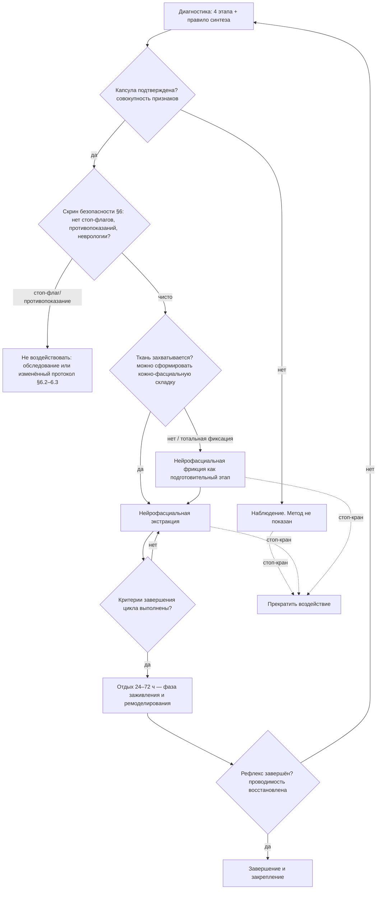

# Подключение к нервной системе (внутр. ярлык — «Блютус»)

> **О названии.** Литерального термина «Блютус» / Bluetooth ни в книге
> «Нейрофасциальная модель психологической травмы» (`fastya.doc`, автор — Александр
> Российский, метод «Код Фасции»), ни на сайте **freshlookhuman.com** нет. Каноническое
> название — **«Подключение к нервной системе»** (шаг 2 схемы «Как это работает»).
> «Блютус» — внутренний мнемонический ярлык по аналогии с сопряжением устройства:
> сначала наводишь канал связи и считываешь ткань, потом «передаёшь» по нему
> (завершаешь рефлекс). **В публичных/клиентских материалах используйте каноническое
> имя**, «Блютус» — только для внутреннего обучения.

> **Об этом документе.** Разделы 1–2 и 4 пересказывают `fastya.doc`. Разделы 5–8
> (метрики, время отдыха, документирование, коммуникация, противопоказания) —
> **практические дополнения**, помеченные как «рабочий ориентир»: в самой книге их нет,
> это операционная обвязка вокруг авторского метода.

---

## 1. Теоретическая основа

Фасция в модели — не просто «оболочка», а **сенсорный орган** и активный посредник
между телом и центральной нервной системой, включённый в **двусторонний
афферентно-эфферентный контур**.

- **Афферентный канал (ткань → мозг).** Фасция непрерывно сообщает ЦНС своё состояние.
- **Эфферентный канал (мозг → ткань).** ЦНС регулирует тонус, микроциркуляцию и
  вегетативный баланс участка.

**Нейрофасциальная капсула** (зона хронического сжатия фасции — телесный субстрат
незавершённого психоэмоционального рефлекса) **разрывает контур с двух сторон**:

| Слом канала | Что происходит | Следствие |
|---|---|---|
| **Афферентный** (ткань → мозг искажён) | В ЦНС идёт устойчивый ложный сигнал угрозы — **«застрявший импульс»** | тревога, напряжение, «готовность» без реальной угрозы |
| **Эфферентный** (мозг → ткань блокирован) | ЦНС теряет доступ к зоне — **периферическая регуляторная изоляция** | реакцию невозможно завершить волевым или когнитивным усилием |

**«Подключение» = восстановить двусторонний канал.** Пока связь не наведена,
воздействовать вслепую нельзя — сначала «сопряжение» и считывание отклика, потом
направленное действие.

---

## 2. Диагностика (пошагово + матрица признаков + правило синтеза)

Наводка контакта с **поверхностной фасцией** — мягко и дозированно, **без провокации
боли**. Цель — наладить обратную связь и найти зону нарушенной проводимости, а не
«помассировать».

1. **Визуально-постуральный осмотр.** Статика тела: симметрия зон, распределение мягких
   тканей, контуры. Ищутся асимметрии и уплощения, **не объяснимые** скелетными
   деформациями или травмой → предварительная гипотеза о зоне фиксации.
2. **Мануальная оценка поверхностной фасции.** Подвижность кожи относительно подлежащих
   тканей, характер скольжения, равномерность сопротивления, **сравнение симметричных
   зон**. Маркер «отключённого участка» — комплекс **кожа–поверхностная фасция** утолщён,
   слит, «губчатый», кожная складка не захватывается / не смещается изолированно.
3. **Сенсорная оценка и субъективный отклик.** Пациент описывает ощущения при лёгком
   смещении ткани (без интерпретации эмоций). Зоны сниженной чувствительности,
   «отсутствия»/«отчуждения» участка — признаки нарушенной афферентной проводимости.
   *Отклик — вспомогательный ориентир, он не заменяет объективной телесной оценки.*
4. **Оценочная провокация тканевой реактивности.** Краткое строго дозированное
   воздействие: в зоне капсулы отклик непропорционально силён; на интактных зонах — нет.
   Задача — подтвердить гипотезу, а не лечить.

**Матрица диагностических признаков** (`fastya.doc`, §3.3):

| Группа | Что оцениваем | Признак капсулы |
|---|---|---|
| **Механические** | скольжение, подвижность, пассивное сопротивление | кожа не скользит, «прилипание», ограничение смещения |
| **Сенсорные** | чувствительность зоны | онемение, «игольчатый» отклик, ощущение «чужого/отсутствующего» участка |
| **Реактивные** | реакция на дозированную провокацию | сильный отклик в первом цикле, угасающий при повторных |
| **Морфологические** | внешний рельеф, моторика | асимметрия мягких тканей без анатомических причин, «деревянная», угловатая моторика |

> **Правило синтеза.** Диагноз капсулы ставится по **совокупности** признаков
> (механика + сенсорика + реактивность + морфология), а не по одному изолированному
> критерию — это защита от гипердиагностики.
>
> **Состояние vs точка.** Капсула не всегда «пятно 2×2 см». При **хроническом многолетнем**
> зажиме или «стеклянном куполе» (Promppp rule 10) напряжение распределено по целому
> сегменту (весь грудной отдел, весь средний пояс). Тогда правило синтеза подтверждает
> **зону** (все 4 группы читаются на протяжении), а не точку; техника — multi-zone
> фрикция / ткань–ткань (§4.5) или поэтапная экстракция по подзонам. «Нет одной точки»
> **≠** «капсула не подтверждена»: хроническая панцирная фиксация подтверждается
> совокупностью и является мишенью метода.

**Шкала тканевой реактивности (рабочий ориентир, 0–4)** — для отслеживания прогресса
между сессиями вместо качественного «сильно/слабо»:

| Балл | Реакция на дозированную провокацию |
|---|---|
| 0 | Отклика нет, ткань как интактная |
| 1 | Лёгкий дискомфорт, сопоставимый с нормой |
| 2 | Заметная, но пропорциональная реакция |
| 3 | Усиленная боль/сосудистая реакция, «непропорционально» |
| 4 | Резкая, защитная реакция, ткани «цепенеют»/отказывается | — это ближе к **стоп-крану**, не к терапевтическому дозирующему давлению

---

## 3. Принятие решения (экстракция vs фрикция vs наблюдение)

Переход от диагностики к воздействию — не по одному признаку, а по ветвлению ниже.

**Перед любым воздействием обязателен скрин безопасности (§6):** неврологические стоп-флаги (§6.2) и матрица противопоказаний (§6.3) проверяются **до** выбора техники, а не «во время». Есть стоп-флаг — техники (§4, §9.1) не выполняются вовсе.



> **Узлы G и I — операциональные критерии.** Прямая инструментация «проводимости» недоступна
> (§8.2). Поэтому узел **G** (завершение цикла) проверяется по четырём маркёрам §5
> (падение реактивности ≥ 2 балла + подвижность/скольжение ≈ контралатеральная + угасание при
> повторной провокации + ровное дыхание). Узел **I** (завершение рефлекса / проводимость
> восстановлена) — более высокий уровень: **совокупная стабильность** этих маркёров
> **на протяжении 2+ последовательных сессий** без возврата исходной симптоматики,
> отсутствие «отката» через 48 ч после последнего цикла, и субъективное ощущение клиента
> «развязалось / тепло / скользит». Если все три условия **не** выполнены одновременно →
> I = нет → возврат к диагностике (A).

---

## 4. Техника воздействия

| Метод | Когда | Как | Суть |
|---|---|---|---|
| **Нейрофасциальная экстракция** (`fastya.doc` §4.2) | Капсула захватывается | Вектор преимущественно вертикальный; точечное прерывание фиксации | Механически разрывает патологический контур; работает **по фасции, не по мышце** |
| **Нейрофасциальная фрикция** (§4.3) | Ткань **не захватывается** (тотальная фиксация) | Контролируемое трение в плоскости фасции, горизонтальные/диагональные векторы | Расцепляет слои; подготовительный этап перед экстракцией |
| **Принцип «ткань–ткань»** (§4.5) | Всегда | Прямой ручной контакт | Физический «уровень» связи: канал наводится руками |

**Каноническая последовательность на сайте:** 1. Обнаружение застрявшего импульса →
**2. Подключение к нервной системе** → 3. Снятие фасциальной капсулы → 4. Освобождение
психики и тела от проблематики.

---

## 5. Цикличность, критерии завершения и отдых

Воздействие идёт циклами **«разрушение фиксации → физиологическое заживление»**.
Именно в фазе заживления происходит ремоделирование ткани, поэтому форсировать нельзя.

**Критерии завершения одного цикла (рабочий ориентир)** — когда остановиться и дать
отдых, а не «дожимать»:

- падение реактивности **на 2+ балла** по шкале §2 в этой же зоне;
- восстановление подвижности/скольжения **до уровня симметричной здоровой зоны**;
- угасание первичной реактивности при повторном проходе;
- субъективное облегчение и расслабленное, ровное дыхание клиента.

> **Что такое «один цикл».** Сессия = один цикл на данной зоне (E→G). Повторный проход E→G
> в той же сессии допустим **только при смене подзоны** (multi-zone, §2 «Состояние vs точка»).
> Та же зона — **не более одного цикла за сессию**, далее обязательный отдых.

**Отдых между циклами (рабочий ориентир):** обычно **24–72 часа** — по состоянию ткани,
а не по календарю. Глубокое/многозонное воздействие → ближе к 72 ч; поверхностное →
24 ч. Ориентир возвращения — угасание реактивности и восстановление подвижности, а не
«истёк срок». В фазе заживления — мягкий режим: тёплый душ, вода, дыхание, без
повторной провокации той же зоны. **Скачкообразное облегчение после первого цикла** (феномен §5.3 источника — быстрая качественная перестройка) — **не** повод пропустить отдых или «добить» самому: ремоделирование ткани идёт именно в фазе заживления, а не при повторном воздействии.

### 5.1 Методы восстановления между циклами (из курса «Глубокая лечения»)
Фаза заживления — не пауза «ни для чего», а активное ремоделирование ткани. Чем мягче и регулярнее режим, тем устойчивее результат цикла. (Это **не** замена стоп-крану §6.1: при истинном сбое дыхания/острой панике — остановить, а не «подышать и продолжить».)

**Дыхание — самый быстрый доступ к нервной системе:**

| Приём | Как | Эффект |
|---|---|---|
| Диафрагмальное | Лёжа/сидя, одна рука на груди, другая на животе; медленный вдох носом «в живот» (рука на животе поднимается, на груди почти неподвижна), медленный выдох | Включает парасимпатику, снижает пульс и давление |
| «4-7-8» | Вдох носом 4 → задержка 7 → медленный выдох ртом 8 (со свистом), 4–6 циклов | «Природный транквилизатор»; перед сном или при нарастании тревоги |
| «Квадрат» | Вдох 4 → задержка 4 → выдох 4 → задержка 4 | Успокаивает ум, собирает внимание, снимает тревожность |

**Прогрессивная мышечная релаксация (Джекобсон)** — через контраст напряжения и расслабления: цепочка **пальцы ног → стопы → икры → бёдра → ягодицы → живот/поясница → кисти → предплечья → плечи → шея → лицо**; сильно напрячь группу на 5–10 с, затем резко отпустить на 20–30 с, ловя волну тепла и расслабления.

**Самомассаж и тепло:** прокатывание массажного мячика по напряжённым зонам (плечи, спина вдоль позвоночника, стопы, ладони) с задержкой на точках до спада напряжения; тёплая ванна / грелка на шею, плечи, живот — снимает спазм и успокаивает нервную систему.

---

## 6. Протокол безопасности

### 6.1 Стоп-краны (прекратить воздействие немедленно)
Простреливающая/пульсирующая боль · головокружение · **распространяющееся** онемение ·
нарушение дыхания с гипервентиляцией, переходящее в обморок · дезориентация /
диссоциация (клиент не понимает где он, «выпал», не откликается на имя).

> **Что НЕ стоп-кран.** Плач, гнев, тремор, глубокий учащённый выдох на 10–15 с,
> временное усиление чувствительности, «выплеск» эмоции после долгого сдерживания —
> **нормальная разрядка** незавершённого рефлекса (§9.1: «эмоциональный всплеск —
> норма, проходит за 2–5 дней»). Стоп срабатывает не на силу эмоции, а на **потерю
> контакта с реальностью** и **неуправляемую вегетатику** (обморок, гипервентиляция,
> судорожный паттерн).

### 6.2 «Замёрзшая зона» ≠ неврология
Локальное онемение, снимаемое отдыхом/дыханием/работой, — мишень метода. Но зона,
немеющая/слабеющая **по анатомии нерва** (по дерматому, половина тела, с нарушением
речи/зрения/координации, нарастает подостро) — **не зажим, а неврология**: сначала
медицинский разбор (осмотр/обследование), а не «развязывание».

### 6.3 Матрица ограничений телесного воздействия
> **Важно про логику.** Ограничения касаются **локального механического** воздействия на
> ткань, а не отказа вести случай. Ведущий, работающий и как врач, **не отстраняет
> человека от помощи и не «передаёт другому»** — он меняет телесный вектор/дозу и при
> необходимости добавляет обследование как **собственное** медицинское решение. Духовная/
> мольбенческая линия при этом продолжается без ограничений.

| Статус | Состояние | Что делать с телесным контуром |
|---|---|---|
| ⛔ Ограничение зоны | Острая травма/рана, свежий гематомный участок, острое воспаление в зоне | Не воздействовать **на эту зону**; обходная работа/наблюдение |
| ⛔ Ограничение техники | Приём антикоагулянтов, склонность к кровоточивости | Исключить агрессивную фрикцию/перфорацию; минимальная доза |
| ⛔ Структурная патология соединительной ткани | **Синдром Элерса–Данлоса**, выраженная гипермобильность, дефекты коллагена | Экстракция (вертикальный вектор) — **противопоказана**: фасция структурно неполноценна, перерастяжение/разрыв. Допустима **лёгкая фрикция** или ткань–ткань с минимальным натяжением; hyperextensible skin ≠ good grasp (не путать с «складка формируется легко = ✅») |
| ⛔ Костно-кожная хрупкость | **Остеопороз**, длительный приём кортикостероидов, пожилой возраст с тонкой/атрофичной кожей | Исключить **выщипывание** (разрыв кожи) и **надавливание на рёбра/позвонки** (патологический перелом). Допустимо: мягкое ткань–ткань, дыхание, PMR без давления |
| ⚠️ Изменённый протокол | **Беременность** — не отказ | Смягчается телесная часть: без глубокого давления на живот/крупные сосуды, щадящая доза; случай продолжает вести тот же специалист |
| ⚠️ Параллельное ведение | Онкология, системные/хронические заболевания | Телесное воздействие — только вне поражённой области и дозированно; **медицинское ведение и прицельная помощь — задача врача, ведущего случай, а не направление «к другому»** |
| 🚫 Не первый фронт | **Острый психоз, выраженные когнитивные нарушения** (`fastya.doc` §5.4); **активная суицидальность / самоповреждение** | Телесное воздействие — **не первый фронт**. Случай ведётся комплексно тем же врачом: сначала стабилизация состояния (при необходимости — координация с профильными специалистами, что не означает отказа от ведения). После стабилизации — стандартный протокол с осторожностью |
| ⚠️ Ограниченный комплаенс | **MCI / мягкие когнитивные нарушения** (не «выраженные», но stop-слово/consent ненадёжны); **дети до 12** (не могут stable informed consent; parent-согласие + child-assent) | Протокол применяется с адаптацией: consent — упрощённым языком + обратный пересказ (для MCI) или родитель + assent ребёнка (для детей); интенсивность снижена (без агрессивного выщипывания/вытягивания у детей; у MCI — контроль понимания каждой команды). Stop-кран §6.1 — визуальный (не вербальный) |
| ✅ Без ограничений | Локальный зажим/капсула без красных флагов | Стандартный цикл: экстракция/фрикция |

---

## 7. Коммуникация с клиентом и документирование сессии

### 7.1 Протокол коммуникации (рабочий ориентир)
- **До:** коротко объяснить, что будет; описать **ожидаемые ощущения** (тепло, покалывание,
  желание дышать глубже, временное усиление чувствительности) — чтобы нормальная
  реактивность не пугалась как «опасность»; получить согласие; задать стоп-слово/жест.
- **Во:** просить описывать ощущения по месту (не по эмоциям/воспоминаниям — это задача
  диагностики); предупреждать о нарастании реакции; при стоп-признаке — останавливаться.
- **После:** что происходит в фазе заживления (возможна временная реакция 24–72 ч),
  режим (душ, вода, дыхание, без повторной провокации той же зоны), когда следующий шаг,
  какие симптомы — норма, а какие — «написать/показать врачу».
- **Чувствительная / интимная зона** (живот ниже пупка, пах, ягодицы, внутренняя поверхность бедра, молочные железы): **отдельное устное согласие на каждую зону** (не общее «согласен на массаж»); клиент в позиции, где видит руки практика; объяснять каждое движение **до** прикосновения; по запросу — присутствие третьего лица; любая застываемость / «отключение» / дезориентация → немедленный **стоп** + мягкое возвращение в «здесь»;  контекст зависимости/иерархии не приравнивается к «да» для интимной зоны.
- **Ограниченная дееспособность согласия** (MCI, лёгкая деменция, ребёнок): consent — упрощённым языком, с **обратным пересказом** («повтори, что сейчас будет»); если пересказ недостоверен → привлекать доверенное лицо (не «передача другому врачу», а именно помощь в коммуникации); стоп-кран — визуальный/тактильный (не положен на вербальное слово); для детей: согласие родителя + «ассент» ребёнка (если ребёнок замирает/отворачивается — не настаивать).

### 7.2 Шаблон протокола сессии
```
Дата / № сессии: ______________________
Зона (локализация капсулы): ____________________
Признаки (мех./сенс./реак./морф.): ______________
Реактивность ДО (0–4): ___   ПОСЛЕ (0–4): ___
Тип воздействия: экстракция / фрикция / комби
Доза, длительность, кол-во циклов: _____________
Критерий завершения цикла выполнен? да / нет
Рекомендация до следующего контакта (отдых, режим): __
Красные флаги / отклонения: ____________________
Подпись ведущего: ______
```

---

## 8. Позиционирование, отличие от смежных методов и уровень доказательности

### 8.1 Чем отличается от соседних телесных подходов
| Метод | Основной фокус | Отличие «Кода Фасции» |
|---|---|---|
| **Миофасциальный релиз (MFR)** | Работа с напряжением миофасции ради механики/боли | Мишень — **поверхностная фасция** как телесный субстрат незавершённого **психоэмоционального** рефлекса; цель — вернуть афферентно-эфферентную проводимость, а не снять боль как таковую |
| **Краниосакральная терапия** | «Ритм» ЦСЖ, мягкие техники черепа/крестца | Иной механизм-претензия; здесь опора на иннервацию фасции и её сенсорную функцию |
| **Rolfing (структурная интеграция)** | Постепенная перестройка осанки/структуры | Акцент на локальной капсуле и «застрявшем импульсе», с быстрым соматическим завершением реакции |

### 8.2 Честная градация доказательности
- **Установлено исследованиями:** фасция богата иннервацией и проприоцепторами,
  участвует в вегетативной регуляции и формировании телесного восприятия (работы
  R. Schleip — фасция и проприоцепция; L. Stecco — анатомия фасциальных систем;
  A. Huijing — фасция как регуляторный орган; анатомия интерстиция).
- **Авторская модель (рабочая гипотеза, независимое исследование, опубликовано
  на Zenodo):** «нейрофасциальная капсула», «застрявший импульс», «соматическое
  завершение психоэмоционального рефлекса» — **оригинальный теоретический конструкт
  автора**, а не устоявшийся клинический стандарт.
- **Статус метода:** автор заявляет «уникален, не имеет аналогов»; признание
  «ChatGPT-4.5» таковым **не является** и не считается независимой валидацией.

---

## 9. Три уровня и полный контур (из курса «Глубокая лечения»)

Метод «подключения» (§1–6) описывает **физический** контур. В курсе автора «Глубокая лечения» зажим снимается на **трёх уровнях**, и к физическому добавляются психосоматический и духовный:

| Уровень | Что фиксировано | Инструмент |
|---|---|---|
| **Физический** | Тело: боль, тяжесть, жар, холод | Ручная триада и экстракция/фрикция (§4, §9.1) |
| **Психосоматический** | Связь с сознанием, незавершённый рефлекс | Диагностика по месту/ощущению + дыхание (§2–3, §5) |
| **Духовный** | Душевный недуг (страх, гнев, зависть…) | Трёхчастная рукъа-формула (§9.2–9.3) |

### 9.1 Физический уровень — само-применяемая триада
Практическая (надомная) форма экстракции/фрикции для самомассажа. Идут **по анатомической карте зажимов от ног к голове**; **живот и грудь** — зоны наиболее глубоких зажимов. **Дыхание обязательно** на каждом приёме (без него эффективность падает).
- **Надавливание** — по точкам зажимов (удобно твёрдым предметом, а не только пальцами), ищем отклик давления.
- **Выщипывание** — захватить кожу, потянуть и отпустить.
- **Вытягивание** — захватить, натянуть и **удерживать ~10 с с глубоким дыханием**.
- Норма реакции: покраснение, временные синяки, мышечная усталость, эмоциональный всплеск — проходят за 2–5 дней; после каждого приёма — душ и вода.
- Все три приёма новичку выполнять **по отдельности** (не подряд), чтобы не перегрузить; сочетают их с опытом.
- **Самоприменение не отменяет скрин (§6).** Перед тем как давить на **живот/грудь** самостоятельно, исключи: беременность, спайки/свежую травму живота, известную **аневризму аорты**, грыжу в зоне, патологию внутренних органов, онкоучасток — там глубокое давление запрещено (§6.3). Локальная «замёрзшая зона» — да; онемение/слабость **по нерву, половина тела, речь/зрение/координация, подострый рост** — не «разминать», а обследование (§6.2).

> ⚠️ **Согласование с техникой безопасности.** В исходнике курса встречается установка «будь грубым/агрессивным, не останавливайся при боли, боль — сигнал давить». **Этот документ её не переносит:** она противоречит и правилу дозированности `fastya.doc` (§5.4), и **стоп-крану** §6.1, и принципу «суть — устранить зажим, а не причинить боль». Интенсивность дозируется **управляемостью и сохранностью контакта** (это «активизация»); а **острая/кинжальная боль, распространяющееся онемение, головокружение, сбой дыхания, паника — это стоп**, а не то, что «преодолевают агрессией».

### 9.2 Духовный уровень — трёхчастная формула на каждый недуг
Соответствует шагу «духовное замещение»: каждый недуг прорабатывается в три действия — **аннулирование → выведение → замещение противоположным качеством**.

1. **Аннулирование** («Убирание грязи», каталог 15): шаблон
   `بِسْمِ اللهِ يُبْطَلُ [недуг]` — *Бисми-Лляхи юбталю [недуг]* — «Именем Аллаха упраздняется [недуг]».
   Пример (страх): `بِسْمِ اللهِ يُبْطَلُ الْخَوْفُ` — *Бисми-Лляхи юбталю-ль-хауф*. Каталог: страх, высокомерие, уныние, зависть, гнев, ненависть, лень, беспокойство, скупость, потребительство, черствость сердца, рассеянность, самообвинение, порочные намерения, духовная пустота.
2. **Выведение** (дуа «Выведение недугов», каталог 30): шаблон
   `يَخْرُجُ اللَّهُ كُلَّ [недуг]` — *Яхружу-Ллаху кулля [недуг]* — «Да выведет Аллах всякий [недуг]».
   Пример (страх): `يَخْرُجُ اللَّهُ كُلَّ خَوْفٍ` — *Яхружу-Ллаху кулля хауфин*.
3. **Замещение** — освободившееся место наполняется противоположным качеством (§9.3), чтобы рефлекс и состояние не зафиксировались заново.

> ⚠️ **Как держать духовный слой (без вреда).**
> - **Формула — обращение к Аллаху, а не заклинание-самотёк.** Исцеляет Аллах; силу не приписываем ни формуле, ни читающему; результат и срок не обещаем.
> - **Не отменяет медицину.** Рукъа/дуа идут **рядом** с назначенным лечением, а не вместо него; телесную болезнь ведёт врач, ведущий случай (по модели `Promppp.md`).
> - **Каталог §9.2–9.3 — про недуги души**, а не про соматические диагнозы: «вывести дуа диабет/инфекцию/опухоль» — misuse, сюда болезни тела не подставляются.
> - **Без самообвинения.** «Черствость сердца», «порочные намерения» — не повод для решётки грехов и вины; при наваждении сомнений и бесконечных перепроверок это **васваса/скрупулёзность** — один вердикт и не кормить ритуал, а не наращивать чтение.
> - **«Духовный взлёт».** Если после практики — подъём без сна и еды, грандиозность, «я исцелил всех» — это **не успех**, а состояние: остановить прицельную линию и подключить медицинский взгляд (страховка курса `modul-4`).

### 9.3 Таблица замещения: недуг → целительное качество (30)

| № | Недуг/загрязнение | Целительное качество |
|---|---|---|
| 1 | Страх | Бесстрашие, упование на Аллаха (таваккуль) |
| 2 | Разочарование | Принятие, гибкость, готовность к новому опыту |
| 3 | Гнев, злость | Спокойствие, терпение, всепрощение |
| 4 | Зависть и ревность | Радость за других (сорадование), щедрость сердца, самодостаточность |
| 5 | Уныние и тоска | Радость, вдохновение, энтузиазм, вкус к жизни |
| 6 | Тревожность | Умиротворение, пребывание «здесь и сейчас», вера, что Аллах устроит твою жизнь |
| 7 | Печаль, скорбь | Принятие утраты, благодарность за опыт, лёгкость на сердце |
| 8 | Томление, беспокойство | Уверенность, сбалансированность, внутренний покой |
| 9 | Одиночество (покинутость) | Связь с Аллахом, вера, что ты не один |
| 10 | Позор, бесчестие | Самоуважение, достоинство, честь |
| 11 | Унижение | Самоценность, независимость от чужого мнения, внутренняя сила |
| 12 | Неудача, провал | Упорство, принятие урока, восприятие как опыта |
| 13 | Крушение надежд | Открытость новому, вера в успех от Аллаха без привязанности к результату |
| 14 | Раздражение | Терпимость, понимание, мягкость |
| 15 | Отчаяние | Надежда, стойкость, внутренний стержень |
| 16 | Одиночество (состояние) | Гармония с собой, наполненность, готовность к общению |
| 17 | Грусть | Благодарность, здоровое лёгкомыслие, принятие |
| 18 | Чувство обманутости | Честность, прощение, открытое сердце |
| 19 | Отвращение | Принятие, терпимость, умение видеть хорошее |
| 20 | Скрытность, подавление эмоций | Искренность, экспрессивность, умение выражать чувства |
| 21 | Смятение, расстройство | Ясность, внутренний порядок, собранность |
| 22 | Истощение (эмоциональное) | Жизненная сила, энергичность, умение восстанавливаться |
| 23 | Переполнение эмоциями | Уравновешенность, спокойствие, умение отпускать |
| 24 | Отчуждённость | Сопричастность, эмпатия, открытость миру |
| 25 | Подавленность, «надломленность» | Целостность, стойкость, внутренний стержень |
| 26 | Недовольство | Принятие, благодарность, умение видеть хорошее |
| 27 | Изнеможение, усталость | Бодрость, энергичность, радость движения |
| 28 | Изоляция (вынужденная) | Открытость, готовность к контакту, выход из зоны комфорта |
| 29 | Замкнутость | Открытость, общительность, доверие |
| 30 | Блокировка/задержка эмоций | Свобода выражения, поток, проживание момента |

> ⚠️ **Предостережения к таблице.**
> - **Нормальная скорбь (#7) — не недуг.** После утраты горевание — живой процесс, он **не выводится** как «грязь». Прицельная мишень — **зафиксированный рефлекс** (капсула), который не даёт скорби пройти естественную дугу и превращает живое чувство в вечный панцирь. Формула работает с капсулой, а не против чувства.
> - **Чужое насилие (#10, #11) — не стыд жертвы.** Если позор/унижение были **нанесены другим** (абьюз, сексуальное насилие, публичное оскорбление), то телесная капсула — это **замороженная реакция на чужое действие**, а не моральный недуг самого человека. Качество «самоуважение / достоинство» здесь — **возвращение** того, что отняли, а не «исправление» жертвы. Формула читается **над реакцией**, а не над личностью.

---

### Источники
- `fastya.doc` — «Нейрофасциальная модель психологической травмы и метод её
  соматического завершения», Александр Российский (§1.2–1.4 сенсорная функция фасции;
  §2.7 застрявший импульс и нарушение проводимости; §3.3 диагностические критерии;
  §3.4 процедура диагностики; §4.2 экстракция; §4.3 фрикция; §4.5 принцип прямого
  ручного воздействия).
- **freshlookhuman.com** — блок «Как это работает», шаг 2 «Подключение к нервной системе».
- **Update.md** — рецензия, лёгшая в основу структуры (разделы 3, 5–8).
- **Курс «Глубокая лечения»** (`Desktop/Desk/Лекарь/глубокая лечения`) — раздел 5.1 и 9: «три уровня устранения зажимов», «Методы расслабления», «Убирание грязи» (15), «Выведение недугов» (30), «Таблица преобразования эмоциональных загрязнений в целительные качества» (30).
